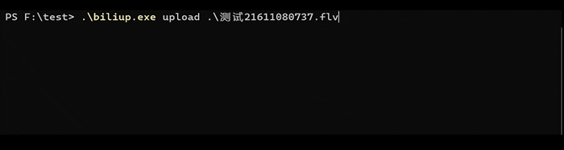

# biliup-rs
> 源码：<https://github.com/ForgQi/biliup-rs> 

biliup-rs 是一个B站命令行投稿工具，支持多p投稿，支持上传线路选择，并发数设置，保证国外服务器上传速度可跑满带宽。
支持 **短信登录**，**账号密码登录**，**扫码登录**，**浏览器登录**
，并将登录后返回的 cookie 和 token 保存在 `cookie.json` 中，可用于其他项目。

### Windows 演示

登录：
```powershell
.\biliup.exe login
```


上传：
```powershell
.\biliup.exe upload
```

